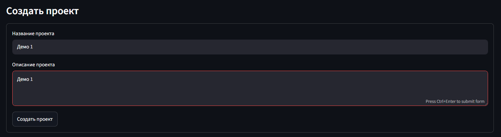
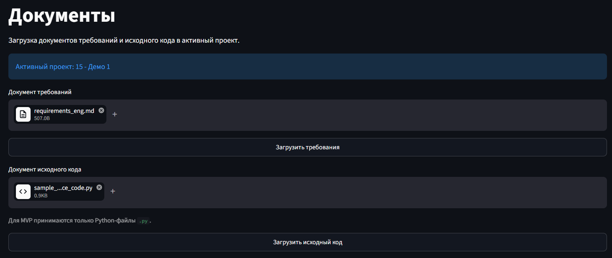
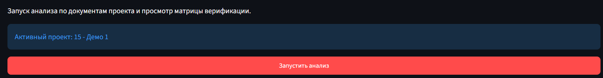
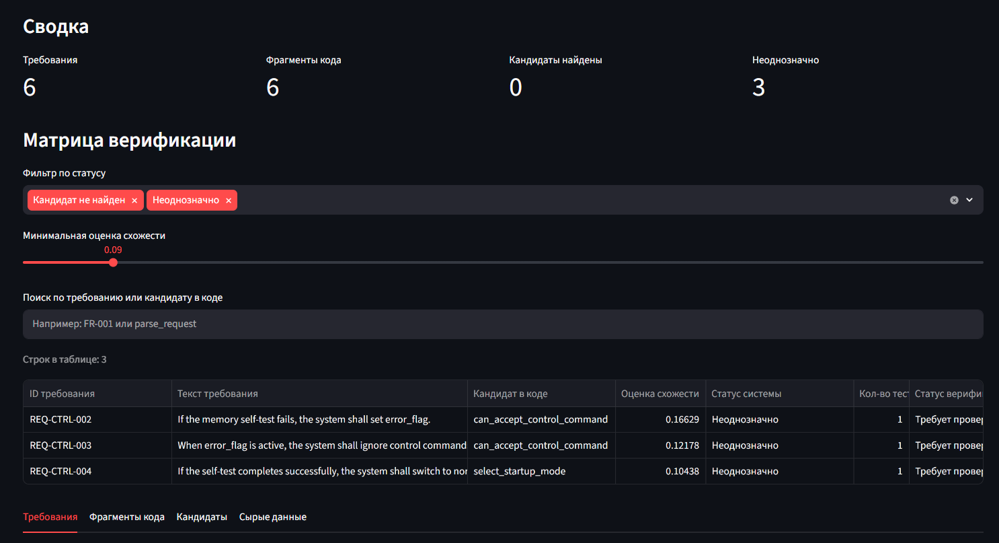
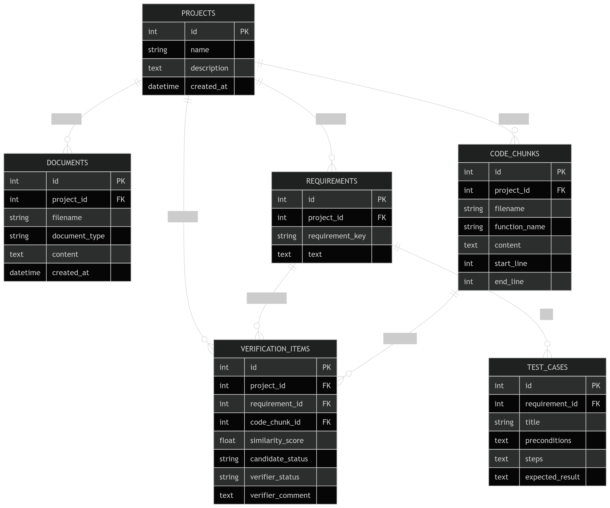

# DevTrace: MVP 1

DevTrace — учебный прототип инструмента для первичного анализа трассируемости между требованиями и исходным кодом.

Проект помогает быстро получить цепочку:

```text
требование -> фрагмент кода -> тест-кейс -> матрица трассируемости кода на требования
```

## Актуальные требования MVP 1

Сокращённая и актуальная спецификация проекта: [DevTrace Requirements.md](DevTrace Requirements.md)

## Что реализовано

Цель текущего MVP 1:

- загрузить документы проекта;
- извлечь требования;
- извлечь фрагменты Python-кода;
- найти кандидатов на соответствие `требование -> код`;
- сгенерировать черновые test cases;
- показать матрицу верификации.

## Ограничения текущего MVP

В текущую версию не входят:

- авторизация;
- ручное изменение статуса верификации и комментирования;
- отдельный редактор тест-кейсов (заглушка);
- ручное добавление тест-кейсов (заглушка);
- Экспорт в CSV;
- Docker / docker-compose;
- OpenAI API, embeddings, vector DB. (предполагается полноценный ИИ-ассистент)

## Стек

- **FastAPI** — backend API.
- **Streamlit** — frontend.
- **SQLite** — локальная база данных.
- **SQLAlchemy** — ORM.
- **Pydantic** — схемы API.
- **scikit-learn** — TF-IDF + cosine similarity.
- **pandas** — табличное представление данных во frontend.

## Локальный запуск

Установка зависимостей:

```bash
pip install -r requirements.txt
```

Запуск backend:

```bash
uvicorn backend.app.main:app --reload
```

Запуск frontend:

```bash
streamlit run frontend/app.py
```

После первого запуска backend создаёт локальную БД:

```text
devtrace.db
```

## Короткий сценарий демо

1. Создать проект на странице `Projects`.


---
2. Загрузить документ требований и `.py` файл исходного кода на странице 
`Documents`. (для демострации лежат в tests/)

---
3. Запустить анализ на странице `Analysis`.

---
4. Посмотреть verification matrix и промежуточные результаты анализа.

---

## Тестовые файлы

Для демо можно использовать:

- [sample_requirements.md](tests/sample_requirements.md)
- [sample_source_code.py](tests/sample_source_code.py)
- [requirements_eng.md](tests/requirements_eng.md)

## Пример архитектуры проекта (общая картина)


## Пример UI проекта


## Правила ведения git

| Тип | Когда использовать | Пример |
|---|---|---|
| `feat` | добавлена новая функциональность | `feat: add project creation API` |
| `fix` | исправление бага | `fix: handle empty file upload` |
| `docs` | изменения только в документации | `docs: update MVP spec` |
| `test` | добавление или изменение тестов | `test: add requirement extractor tests` |
| `chore` | служебные изменения | `chore: initialize project structure` |
| `refactor` | переработка кода без изменения поведения | `refactor: simplify extractor pipeline` |
| `style` | форматирование без изменения логики | `style: format code with black` |
| `perf` | улучшение производительности | `perf: optimize TF-IDF similarity calculation` |
| `build` | изменения зависимостей и сборки | `build: update requirements` |
| `ci` | изменения CI/CD | `ci: add GitHub Actions workflow` |
| `revert` | откат предыдущего коммита | `revert: revert draft test case generator` |

## Схема БД


